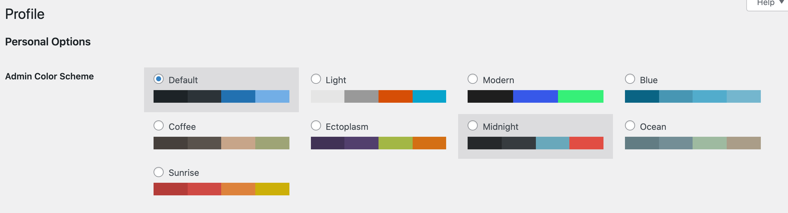

# WordPress Remove Admin Color Scheme Setting

This is a simple plugin that removes the option to set a color scheme in the user profile.

## What are you talking about?

This setting:

## Why?

Because it's the first setting in the admin and it's annoying, especially for non-admins of the site who are trying to update their profile.
